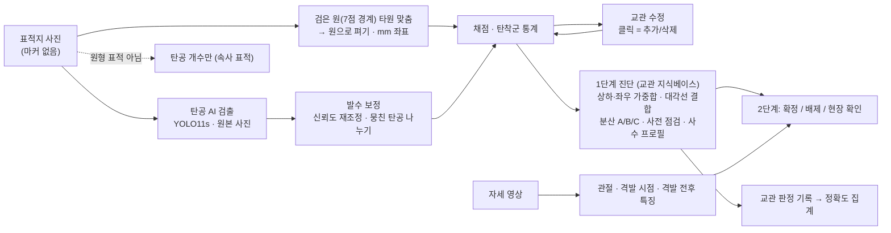

# 구조

## 설계 결정

| 결정 | 이유 |
|---|---|
| 마커 없이 **검은 원**으로 표적 찾기 | 현장 표적에는 마커가 없다. 해경 원형 표적 실사진 11/11에서 검은 원을 찾았다 |
| 탄공은 **원본 사진**에서 검출, 좌표만 변환 | 모델이 원본 사진(폰 촬영)으로 학습됐다. 펴는 과정의 보간 손실이 없다 |
| **발수 보정** | 완사는 발수가 정해져 있다. 서울청 STARS 과제에서 97% → 99.4%를 만든 요령 |
| **교관 수정**을 제품 기능으로 | 실데이터가 적어 AI 단독 정확도에 한계가 있다. 수정하면 최종 결과는 항상 맞고, 수정 결과는 다음 학습 데이터가 된다 |
| 진단 = **교관 지식베이스 가중합** | 교관 자료가 1차원 매핑(방향 → 원인 한 개)을 명시적으로 배제한다 |
| 지식베이스는 **YAML 한 파일** | 교관이 코드 없이 문구·가중치·체크리스트를 고친다 |
| 판정은 규칙, 언어 모델은 문장만 | 언어 모델이 원인을 지어내면 교정 방향이 틀린다. 검증 가드 실패 시 기본 문장 |
