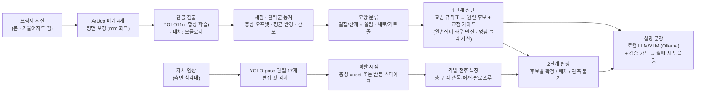

# 구조

## 핵심 설계 결정

| 결정 | 이유 |
|---|---|
| 판정은 **규칙 엔진**, 언어 모델은 **문장만** | 언어 모델이 원인을 지어내면 교정 방향이 틀린다. 규칙(`rules/*.csv`)은 교관이 직접 고칠 수 있다 |
| 표적지 **마커 4개**로 정면 보정 | 외곽선 추정 방식은 단계 오차가 누적된다 (arXiv 2601.17062: 세그멘테이션 72.9%가 병목). 마커는 결정적이고 mm 환산이 자동 |
| 실제 사격장 표적지는 **마커 스티커** + 설정 파일 | 표적지를 새로 인쇄할 필요 없이 기존 해경 표적지에 붙이고 위치만 실측 (`configs/*.yaml`) |
| 합성 데이터로 1차 학습 | 해경 데이터가 오기 전에 파이프라인을 끝까지 검증. 실제 데이터는 파인튜닝용 (맥 로컬, 외부 전송 없음) |
| 1단계는 **후보**, 2단계에서 **확정** | 진단 차트는 사수마다 안 맞는다는 비판(Lucky Gunner 등)에 대한 답. 자세 신호가 없으면 **보류** |
| 관측 불가를 숨기지 않음 | 측면 영상으로 좌우 흔들림·총기 기울임·시선은 못 본다. "관측 불가"로 표시하고 후보로 남긴다 |
| 편집 컷 감지 | 실제 홍보 영상에서 장면 전환을 반동으로 오인한 사례를 보고 추가 |
| 설명 문장 **검증 가드** | 3B VLM이 지시문을 따라 쓰거나 최종 원인을 빼먹은 사례 → 검증 실패 시 템플릿 |

## 모듈

| 경로 | 역할 |
|---|---|
| `shootcoach/target/template.py` | 인쇄용 표적지 (링 + ArUco) |
| `shootcoach/target/markers.py` | 마커 검출 → 호모그래피 → 정면 보정 |
| `shootcoach/target/detect.py` | `YoloHoleDetector`, `ClassicHoleDetector` |
| `shootcoach/target/scoring.py` | 채점(가장자리 판정), 탄착군 통계, 모양 분류, 플라이어 제외 |
| `shootcoach/target/sequence.py` | 회차별 촬영 시 새 탄공만 골라내기 |
| `shootcoach/diagnosis/stage1.py` | 1단계 진단 (규칙표 조회, 좌우 반전, 영점 클릭) |
| `shootcoach/diagnosis/stage2.py` | 2단계 판정 (신호 → 확정/배제/관측 불가) |
| `shootcoach/pose/*` | 관절 추출, 격발 검출, 특징, 합성 자세, 렌더 |
| `shootcoach/explain/vlm.py` | Ollama 호출, 검증 가드, 템플릿 |
| `shootcoach/synth.py` | 합성 표적지·탄공·사진 시뮬레이션, 선 그림 음성 샘플 |
| `rules/*.csv` | **교관이 수정하는 규칙표** (코드 수정 불필요) |
